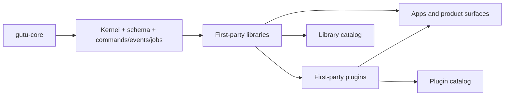

# gutu-libraries

  

Catalog repository for first-party Gutu libraries.

This catalog is a **truth-first index** for the extracted library ecosystem. The badges and maturity labels referenced here are local-status documentation badges backed by repo facts, not live npm or GitHub Actions badges.

## Live Catalog Surface

- `catalog/index.json` tracks the full first-party library inventory.
- `channels/stable.json` and `channels/next.json` are the installable release channels used by `gutu vendor sync`.
- Promoted `stable` channel entries point at signed GitHub Release assets and are validated in CI before merge.
- Unreleased or unpromoted packages stay on `next` even when the repo is mature, so the catalog never claims a stable install path without a verified artifact.

## Package Namespace Policy

- `@gutu/*` is the canonical framework namespace for new public packages and docs.
- Existing first-party libraries under `@platform/*` remain legacy compatibility ids until the migration is complete.
- Catalog entries carry both the current package id and a canonical Gutu target id so dashboard and release tooling can present one consistent namespace story without breaking current consumers.

## What Gutu Solves

| Platform Problem | Typical Failure Mode | Gutu Response |
| --- | --- | --- |
| Shared code turns into undocumented internal glue | Teams copy utilities across apps and silently fork behavior. | Gutu libraries keep reusable behavior versioned, typed, and documented as standalone repos. |
| UI primitives drift from domain/runtime contracts | Frontend work becomes coupled to product-specific assumptions. | Libraries separate UI foundations, data helpers, and runtime packages from plugin-level business ownership. |
| Repo extraction breaks consumption ergonomics | Independent packages become painful to install and verify together. | Gutu uses workspace-aware docs, vendor sync, and certification to keep multi-repo consumption honest. |

## Ecosystem Shape

## Library Maturity Matrix

| Library | Packages | Domain | Maturity | Verification | UI | Consumption | Docs |
| --- | --- | --- | --- | --- | --- | --- | --- |
| [Admin Builders](../libraries/gutu-lib-admin-builders/README.md) | 1 | Admin Experience | Hardened | Build+Typecheck+Lint+Test | Mixed runtime helpers | Imports + typed UI primitives | [Developer](../libraries/gutu-lib-admin-builders/DEVELOPER.md) |
| [Admin Contracts](../libraries/gutu-lib-admin-contracts/README.md) | 1 | Admin Experience | Hardened | Build+Typecheck+Lint+Test | Mixed runtime helpers | Imports + typed UI primitives | [Developer](../libraries/gutu-lib-admin-contracts/DEVELOPER.md) |
| [Admin Form View](../libraries/gutu-lib-admin-formview/README.md) | 1 | Admin Experience | Hardened | Build+Typecheck+Lint+Test | Headless typed exports | Imports + typed helpers | [Developer](../libraries/gutu-lib-admin-formview/DEVELOPER.md) |
| [Admin List View](../libraries/gutu-lib-admin-listview/README.md) | 1 | Admin Experience | Hardened | Build+Typecheck+Lint+Test | Headless typed exports | Imports + typed helpers | [Developer](../libraries/gutu-lib-admin-listview/DEVELOPER.md) |
| [Admin Reporting](../libraries/gutu-lib-admin-reporting/README.md) | 1 | Admin Experience | Baseline | Build+Typecheck+Lint+Test | Headless typed exports | Imports + typed helpers | [Developer](../libraries/gutu-lib-admin-reporting/DEVELOPER.md) |
| [Admin Shell Workbench](../libraries/gutu-lib-admin-shell-workbench/README.md) | 1 | Admin Experience | Hardened | Build+Typecheck+Lint+Test | React UI + typed helpers | Imports + typed UI primitives | [Developer](../libraries/gutu-lib-admin-shell-workbench/DEVELOPER.md) |
| [Admin Widgets](../libraries/gutu-lib-admin-widgets/README.md) | 1 | Admin Experience | Hardened | Build+Typecheck+Lint+Test | Mixed runtime helpers | Imports + typed UI primitives | [Developer](../libraries/gutu-lib-admin-widgets/DEVELOPER.md) |
| [AI](../libraries/gutu-lib-ai/README.md) | 1 | AI Foundation | Hardened | Build+Typecheck+Lint+Test | Headless typed exports | Imports + typed helpers | [Developer](../libraries/gutu-lib-ai/DEVELOPER.md) |
| [AI Evals](../libraries/gutu-lib-ai-evals/README.md) | 1 | AI Foundation | Hardened | Build+Typecheck+Lint+Test | Headless typed exports | Imports + typed helpers | [Developer](../libraries/gutu-lib-ai-evals/DEVELOPER.md) |
| [AI Guardrails](../libraries/gutu-lib-ai-guardrails/README.md) | 1 | AI Foundation | Hardened | Build+Typecheck+Lint+Test | Headless typed exports | Imports + typed helpers | [Developer](../libraries/gutu-lib-ai-guardrails/DEVELOPER.md) |
| [AI MCP](../libraries/gutu-lib-ai-mcp/README.md) | 1 | AI Foundation | Hardened | Build+Typecheck+Lint+Test | Headless typed exports | Imports + typed helpers | [Developer](../libraries/gutu-lib-ai-mcp/DEVELOPER.md) |
| [AI Memory](../libraries/gutu-lib-ai-memory/README.md) | 1 | AI Foundation | Hardened | Build+Typecheck+Lint+Test | Headless typed exports | Imports + typed helpers | [Developer](../libraries/gutu-lib-ai-memory/DEVELOPER.md) |
| [AI Runtime](../libraries/gutu-lib-ai-runtime/README.md) | 1 | AI Foundation | Hardened | Build+Typecheck+Lint+Test | Headless typed exports | Imports + typed helpers | [Developer](../libraries/gutu-lib-ai-runtime/DEVELOPER.md) |
| [Analytics](../libraries/gutu-lib-analytics/README.md) | 1 | Core Data And Query | Hardened | Build+Typecheck+Lint+Test | Headless typed exports | Imports + typed helpers | [Developer](../libraries/gutu-lib-analytics/DEVELOPER.md) |
| [Communication](../libraries/gutu-lib-communication/README.md) | 1 | Core Data And Query | Hardened | Build+Typecheck+Lint+Test | Headless typed exports | Imports + typed helpers | [Developer](../libraries/gutu-lib-communication/DEVELOPER.md) |
| [Contracts](../libraries/gutu-lib-contracts/README.md) | 1 | Core Data And Query | Hardened | Build+Typecheck+Lint+Test+Contracts | Headless typed exports | Imports + typed helpers | [Developer](../libraries/gutu-lib-contracts/DEVELOPER.md) |
| [Data Table](../libraries/gutu-lib-data-table/README.md) | 1 | Core Data And Query | Hardened | Build+Typecheck+Lint+Test | Headless typed exports | Imports + typed helpers | [Developer](../libraries/gutu-lib-data-table/DEVELOPER.md) |
| [Email Templates](../libraries/gutu-lib-email-templates/README.md) | 1 | Core Data And Query | Baseline | Build+Typecheck+Lint+Test | Headless typed exports | Imports + typed helpers | [Developer](../libraries/gutu-lib-email-templates/DEVELOPER.md) |
| [Form](../libraries/gutu-lib-form/README.md) | 1 | Core Data And Query | Baseline | Build+Typecheck+Lint+Test | Headless typed exports | Imports + typed helpers | [Developer](../libraries/gutu-lib-form/DEVELOPER.md) |
| [Geo](../libraries/gutu-lib-geo/README.md) | 1 | Core Data And Query | Hardened | Build+Typecheck+Lint+Test | Headless typed exports | Imports + typed helpers | [Developer](../libraries/gutu-lib-geo/DEVELOPER.md) |
| [Payments](../libraries/gutu-lib-payments/README.md) | 101 | Core Data And Query | Hardened | Build+Typecheck+Lint+Test+Contracts | Headless typed exports | Imports + typed helpers | [Developer](../libraries/gutu-lib-payments/DEVELOPER.md) |
| [Query](../libraries/gutu-lib-query/README.md) | 1 | Core Data And Query | Baseline | Build+Typecheck+Lint+Test | Headless typed exports | Imports + typed helpers | [Developer](../libraries/gutu-lib-query/DEVELOPER.md) |
| [Router](../libraries/gutu-lib-router/README.md) | 1 | Core Data And Query | Baseline | Build+Typecheck+Lint+Test | Headless typed exports | Imports + typed helpers | [Developer](../libraries/gutu-lib-router/DEVELOPER.md) |
| [Search](../libraries/gutu-lib-search/README.md) | 1 | Core Data And Query | Hardened | Build+Typecheck+Lint+Test | Headless typed exports | Imports + typed helpers | [Developer](../libraries/gutu-lib-search/DEVELOPER.md) |
| [Telemetry UI](../libraries/gutu-lib-telemetry-ui/README.md) | 1 | Core Data And Query | Baseline | Build+Typecheck+Lint+Test | Headless typed exports | Imports + typed helpers | [Developer](../libraries/gutu-lib-telemetry-ui/DEVELOPER.md) |
| [Chart](../libraries/gutu-lib-chart/README.md) | 1 | UI Foundation | Hardened | Build+Typecheck+Lint+Test | Mixed runtime helpers | Imports + typed UI primitives | [Developer](../libraries/gutu-lib-chart/DEVELOPER.md) |
| [Command Palette](../libraries/gutu-lib-command-palette/README.md) | 1 | UI Foundation | Baseline | Build+Typecheck+Lint+Test | Mixed runtime helpers | Imports + typed UI primitives | [Developer](../libraries/gutu-lib-command-palette/DEVELOPER.md) |
| [Editor](../libraries/gutu-lib-editor/README.md) | 1 | UI Foundation | Baseline | Build+Typecheck+Lint+Test | React UI + typed helpers | Imports + typed UI primitives | [Developer](../libraries/gutu-lib-editor/DEVELOPER.md) |
| [Layout](../libraries/gutu-lib-layout/README.md) | 1 | UI Foundation | Baseline | Build+Typecheck+Lint+Test | Mixed runtime helpers | Imports + typed UI primitives | [Developer](../libraries/gutu-lib-layout/DEVELOPER.md) |
| [UI](../libraries/gutu-lib-ui/README.md) | 1 | UI Foundation | Hardened | Build+Typecheck+Lint+Test | Mixed runtime helpers | Imports + typed UI primitives | [Developer](../libraries/gutu-lib-ui/DEVELOPER.md) |
| [UI Editor](../libraries/gutu-lib-ui-editor/README.md) | 1 | UI Foundation | Baseline | Build+Typecheck+Lint+Test | Headless typed exports | Imports + typed helpers | [Developer](../libraries/gutu-lib-ui-editor/DEVELOPER.md) |
| [UI Form](../libraries/gutu-lib-ui-form/README.md) | 1 | UI Foundation | Hardened | Build+Typecheck+Lint+Test | Headless typed exports | Imports + typed helpers | [Developer](../libraries/gutu-lib-ui-form/DEVELOPER.md) |
| [UI Kit](../libraries/gutu-lib-ui-kit/README.md) | 1 | UI Foundation | Hardened | Build+Typecheck+Lint+Test | Mixed runtime helpers | Imports + typed UI primitives | [Developer](../libraries/gutu-lib-ui-kit/DEVELOPER.md) |
| [UI Query](../libraries/gutu-lib-ui-query/README.md) | 1 | UI Foundation | Hardened | Build+Typecheck+Lint+Test | Headless typed exports | Imports + typed helpers | [Developer](../libraries/gutu-lib-ui-query/DEVELOPER.md) |
| [UI Router](../libraries/gutu-lib-ui-router/README.md) | 1 | UI Foundation | Hardened | Build+Typecheck+Lint+Test | Mixed runtime helpers | Imports + typed UI primitives | [Developer](../libraries/gutu-lib-ui-router/DEVELOPER.md) |
| [UI Shell](../libraries/gutu-lib-ui-shell/README.md) | 1 | UI Foundation | Hardened | Build+Typecheck+Lint+Test | Mixed runtime helpers | Imports + typed UI primitives | [Developer](../libraries/gutu-lib-ui-shell/DEVELOPER.md) |
| [UI Table](../libraries/gutu-lib-ui-table/README.md) | 1 | UI Foundation | Hardened | Build+Typecheck+Lint+Test | Headless typed exports | Imports + typed helpers | [Developer](../libraries/gutu-lib-ui-table/DEVELOPER.md) |
| [UI Zone Next](../libraries/gutu-lib-ui-zone-next/README.md) | 1 | UI Foundation | Baseline | Build+Typecheck+Lint+Test | Headless typed exports | Imports + typed helpers | [Developer](../libraries/gutu-lib-ui-zone-next/DEVELOPER.md) |
| [UI Zone Static](../libraries/gutu-lib-ui-zone-static/README.md) | 1 | UI Foundation | Baseline | Build+Typecheck+Lint+Test | Headless typed exports | Imports + typed helpers | [Developer](../libraries/gutu-lib-ui-zone-static/DEVELOPER.md) |

## Admin Experience

| Library | Packages | Maturity | Verification | UI | Consumption | Highlights |
| --- | --- | --- | --- | --- | --- | --- |
| [Admin Builders](../libraries/gutu-lib-admin-builders/README.md) | 1 | Hardened | Build+Typecheck+Lint+Test | Mixed runtime helpers | Imports + typed UI primitives | admin composition, layout builders, operator scaffolding |
| [Admin Contracts](../libraries/gutu-lib-admin-contracts/README.md) | 1 | Hardened | Build+Typecheck+Lint+Test | Mixed runtime helpers | Imports + typed UI primitives | registry contracts, admin access, legacy adapters |
| [Admin Form View](../libraries/gutu-lib-admin-formview/README.md) | 1 | Hardened | Build+Typecheck+Lint+Test | Headless typed exports | Imports + typed helpers | form views, admin editors, resource-driven forms |
| [Admin List View](../libraries/gutu-lib-admin-listview/README.md) | 1 | Hardened | Build+Typecheck+Lint+Test | Headless typed exports | Imports + typed helpers | list views, admin indexes, resource tables |
| [Admin Reporting](../libraries/gutu-lib-admin-reporting/README.md) | 1 | Baseline | Build+Typecheck+Lint+Test | Headless typed exports | Imports + typed helpers | reporting helpers, operator summaries, admin analytics |
| [Admin Shell Workbench](../libraries/gutu-lib-admin-shell-workbench/README.md) | 1 | Hardened | Build+Typecheck+Lint+Test | React UI + typed helpers | Imports + typed UI primitives | workspace shell, admin navigation, operator workbench |
| [Admin Widgets](../libraries/gutu-lib-admin-widgets/README.md) | 1 | Hardened | Build+Typecheck+Lint+Test | Mixed runtime helpers | Imports + typed UI primitives | widgets, summary cards, admin composition |

## AI Foundation

| Library | Packages | Maturity | Verification | UI | Consumption | Highlights |
| --- | --- | --- | --- | --- | --- | --- |
| [AI](../libraries/gutu-lib-ai/README.md) | 1 | Hardened | Build+Typecheck+Lint+Test | Headless typed exports | Imports + typed helpers | typed AI helpers, prompt composition, model-facing contracts |
| [AI Evals](../libraries/gutu-lib-ai-evals/README.md) | 1 | Hardened | Build+Typecheck+Lint+Test | Headless typed exports | Imports + typed helpers | evaluation helpers, baseline comparisons, AI verification |
| [AI Guardrails](../libraries/gutu-lib-ai-guardrails/README.md) | 1 | Hardened | Build+Typecheck+Lint+Test | Headless typed exports | Imports + typed helpers | guardrails, validation, policy enforcement |
| [AI MCP](../libraries/gutu-lib-ai-mcp/README.md) | 1 | Hardened | Build+Typecheck+Lint+Test | Headless typed exports | Imports + typed helpers | MCP helpers, tool contracts, transport composition |
| [AI Memory](../libraries/gutu-lib-ai-memory/README.md) | 1 | Hardened | Build+Typecheck+Lint+Test | Headless typed exports | Imports + typed helpers | memory helpers, retrieval state, AI persistence seams |
| [AI Runtime](../libraries/gutu-lib-ai-runtime/README.md) | 1 | Hardened | Build+Typecheck+Lint+Test | Headless typed exports | Imports + typed helpers | runtime state, execution helpers, AI orchestration primitives |

## Core Data And Query

| Library | Packages | Maturity | Verification | UI | Consumption | Highlights |
| --- | --- | --- | --- | --- | --- | --- |
| [Analytics](../libraries/gutu-lib-analytics/README.md) | 1 | Hardened | Build+Typecheck+Lint+Test | Headless typed exports | Imports + typed helpers | analytics helpers, typed metrics, telemetry composition |
| [Communication](../libraries/gutu-lib-communication/README.md) | 1 | Hardened | Build+Typecheck+Lint+Test | Headless typed exports | Imports + typed helpers | communication helpers, delivery compilers, deterministic providers |
| [Contracts](../libraries/gutu-lib-contracts/README.md) | 1 | Hardened | Build+Typecheck+Lint+Test+Contracts | Headless typed exports | Imports + typed helpers | shared contracts, type utilities, cross-package consistency |
| [Data Table](../libraries/gutu-lib-data-table/README.md) | 1 | Hardened | Build+Typecheck+Lint+Test | Headless typed exports | Imports + typed helpers | data tables, table state, list helpers |
| [Email Templates](../libraries/gutu-lib-email-templates/README.md) | 1 | Baseline | Build+Typecheck+Lint+Test | Headless typed exports | Imports + typed helpers | email templates, rendering helpers, transactional messaging |
| [Form](../libraries/gutu-lib-form/README.md) | 1 | Baseline | Build+Typecheck+Lint+Test | Headless typed exports | Imports + typed helpers | form helpers, schema state, input composition |
| [Geo](../libraries/gutu-lib-geo/README.md) | 1 | Hardened | Build+Typecheck+Lint+Test | Headless typed exports | Imports + typed helpers | geographic helpers, location utilities, typed coordinates |
| [Payments](../libraries/gutu-lib-payments/README.md) | 101 | Hardened | Build+Typecheck+Lint+Test+Contracts | Headless typed exports | Imports + typed helpers | payment contracts, provider registry, support-matrix generation |
| [Query](../libraries/gutu-lib-query/README.md) | 1 | Baseline | Build+Typecheck+Lint+Test | Headless typed exports | Imports + typed helpers | query helpers, typed data access, shared request patterns |
| [Router](../libraries/gutu-lib-router/README.md) | 1 | Baseline | Build+Typecheck+Lint+Test | Headless typed exports | Imports + typed helpers | routing contracts, navigation helpers, URL semantics |
| [Search](../libraries/gutu-lib-search/README.md) | 1 | Hardened | Build+Typecheck+Lint+Test | Headless typed exports | Imports + typed helpers | search helpers, result contracts, query composition |
| [Telemetry UI](../libraries/gutu-lib-telemetry-ui/README.md) | 1 | Baseline | Build+Typecheck+Lint+Test | Headless typed exports | Imports + typed helpers | telemetry helpers, UI metrics, front-end observability |

## UI Foundation

| Library | Packages | Maturity | Verification | UI | Consumption | Highlights |
| --- | --- | --- | --- | --- | --- | --- |
| [Chart](../libraries/gutu-lib-chart/README.md) | 1 | Hardened | Build+Typecheck+Lint+Test | Mixed runtime helpers | Imports + typed UI primitives | charts, visual analytics, dashboard primitives |
| [Command Palette](../libraries/gutu-lib-command-palette/README.md) | 1 | Baseline | Build+Typecheck+Lint+Test | Mixed runtime helpers | Imports + typed UI primitives | command palette, keyboard actions, shared interactions |
| [Editor](../libraries/gutu-lib-editor/README.md) | 1 | Baseline | Build+Typecheck+Lint+Test | React UI + typed helpers | Imports + typed UI primitives | editor primitives, rich editing, shared authoring UI |
| [Layout](../libraries/gutu-lib-layout/README.md) | 1 | Baseline | Build+Typecheck+Lint+Test | Mixed runtime helpers | Imports + typed UI primitives | layout primitives, responsive structure, shared composition |
| [UI](../libraries/gutu-lib-ui/README.md) | 1 | Hardened | Build+Typecheck+Lint+Test | Mixed runtime helpers | Imports + typed UI primitives | UI primitives, shared components, front-end foundations |
| [UI Editor](../libraries/gutu-lib-ui-editor/README.md) | 1 | Baseline | Build+Typecheck+Lint+Test | Headless typed exports | Imports + typed helpers | editor UI, authoring helpers, component composition |
| [UI Form](../libraries/gutu-lib-ui-form/README.md) | 1 | Hardened | Build+Typecheck+Lint+Test | Headless typed exports | Imports + typed helpers | form components, interaction primitives, shared inputs |
| [UI Kit](../libraries/gutu-lib-ui-kit/README.md) | 1 | Hardened | Build+Typecheck+Lint+Test | Mixed runtime helpers | Imports + typed UI primitives | presentational components, visual system, shared styling |
| [UI Query](../libraries/gutu-lib-ui-query/README.md) | 1 | Hardened | Build+Typecheck+Lint+Test | Headless typed exports | Imports + typed helpers | query UI, view state, data-driven front-end helpers |
| [UI Router](../libraries/gutu-lib-ui-router/README.md) | 1 | Hardened | Build+Typecheck+Lint+Test | Mixed runtime helpers | Imports + typed UI primitives | router-aware UI, navigation components, front-end composition |
| [UI Shell](../libraries/gutu-lib-ui-shell/README.md) | 1 | Hardened | Build+Typecheck+Lint+Test | Mixed runtime helpers | Imports + typed UI primitives | shell registry, providers, navigation and telemetry |
| [UI Table](../libraries/gutu-lib-ui-table/README.md) | 1 | Hardened | Build+Typecheck+Lint+Test | Headless typed exports | Imports + typed helpers | table UI, data-heavy views, shared interactions |
| [UI Zone Next](../libraries/gutu-lib-ui-zone-next/README.md) | 1 | Baseline | Build+Typecheck+Lint+Test | Headless typed exports | Imports + typed helpers | zone composition, pluggable regions, next-generation UI assembly |
| [UI Zone Static](../libraries/gutu-lib-ui-zone-static/README.md) | 1 | Baseline | Build+Typecheck+Lint+Test | Headless typed exports | Imports + typed helpers | static zones, pluggable regions, bounded composition |

## Catalog Notes

- Every library repo is expected to publish a public `README.md`, a deep `DEVELOPER.md`, and a repo-local `TODO.md`.
- Libraries should describe imports, providers, callbacks, and typed helpers honestly rather than implying undocumented global hooks.
- Split-repo consumption still relies on the Gutu workspace/vendor model when `workspace:*` dependencies are present.
- Multi-package library repos are allowed when the package catalog, release metadata, and root docs all enumerate the nested packages honestly.
